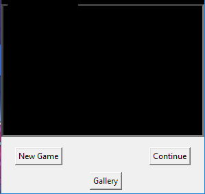
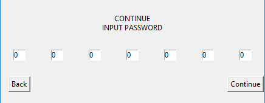
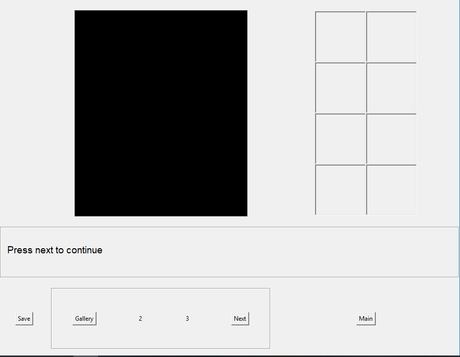

# CapstoneProject
## Synopsis
A Visual Novel-ish mystery game I made for my Capstone Project. It uses python Tkinter guis.

A very simple mystery game following Taylor Arthur, a newbie private investigator, and his mentor and boss Sophia Morgan.

## A Quick Look
It doesn't look that great yet, but that's mostly because I haven't been able to put the art I wanted in it.

Those Black Spaces are where I wanted to put pictures that go with the story.

## How to run
Use Idle, or anything that can run .py files. Run the File CPGS.py.

## Motivation
What motivated me to create this is rather simple. I had an idea and decided that I was going to make it reality. So I did. While it's not perfect in my eyes (See the black voids where I wanted images and other minor asthetic issues), It is complete. The game runs from the start of the story's script to it's end. I'll probably work on this some more and see if I can't get some images for it. While it is complete, There's always something I could refine or improve. But that's all for now.
